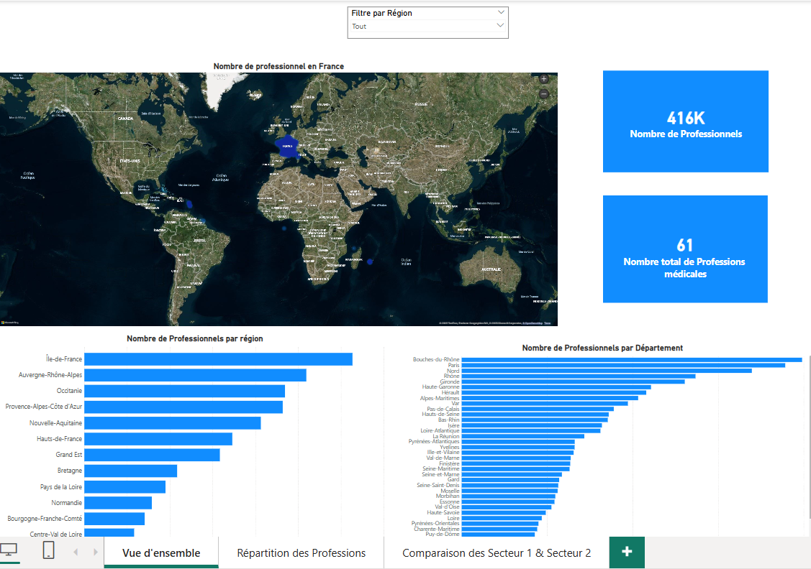
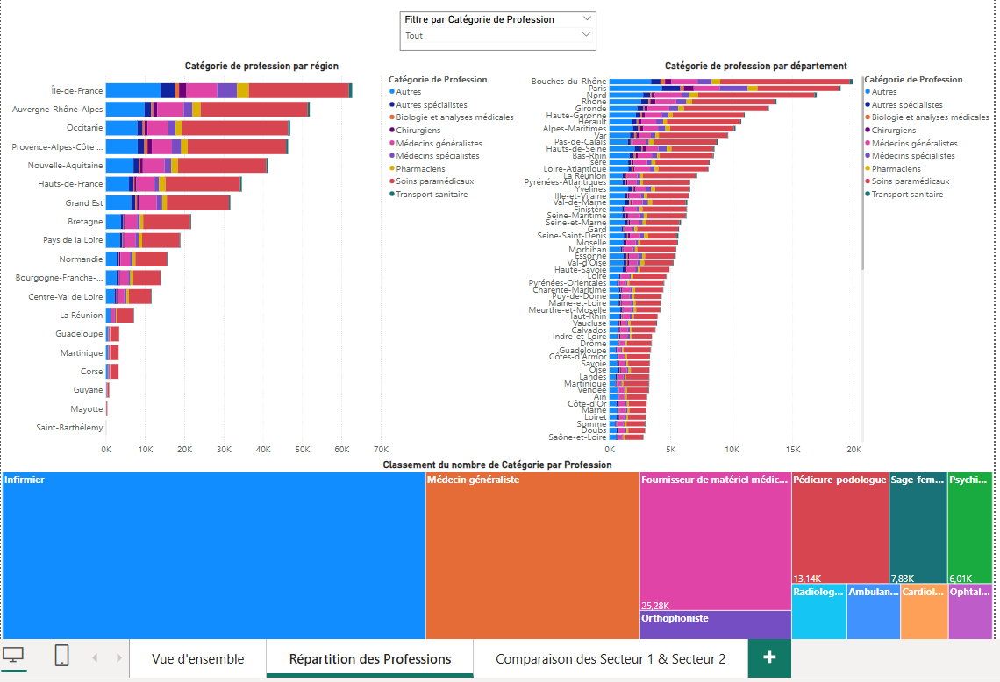
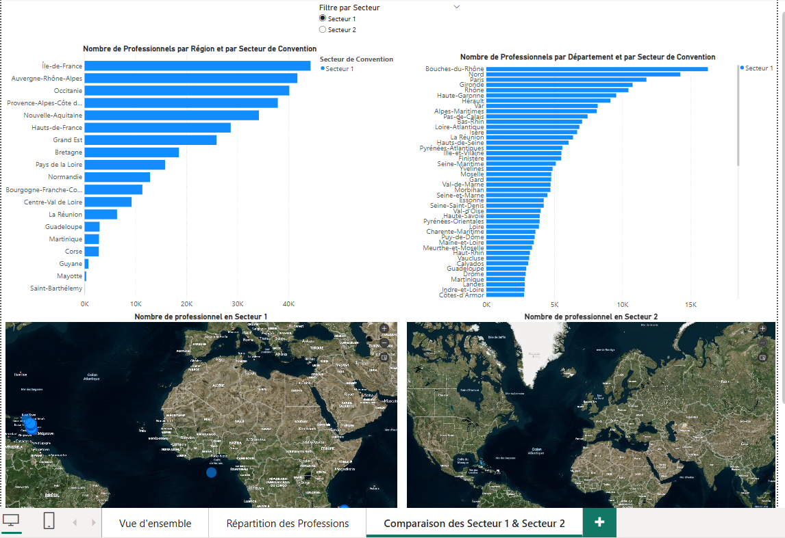

# Analyse géographique des professionnels de santé en France – Power BI

Ce projet a été réalisé dans le cadre du cours VLN (Visualisation et Langage Naturel) du Master MIAGE, Université de Rennes.

## Objectif

Explorer les données issues de l’annuaire OpenDataSoft des professionnels de santé afin de :

- Analyser les disparités géographiques d’accès aux professionnels de santé (régions et départements)
- Étudier la répartition des professions selon les spécialités médicales et les secteurs de convention (1 et 2)
- Créer un tableau de bord interactif accessible et lisible pour les décideurs

## Données utilisées

- Source : [Annuaire et localisation des professionnels de santé – OpenDataSoft](https://public.opendatasoft.com/explore/dataset/annuaire-des-professionnels-de-sante)
- Format : CSV (plus de 400 000 lignes)

## Étapes du projet

- Préparation et nettoyage des données avec Power Query (suppression des doublons, filtres, formatage)
- Modélisation relationnelle dans Power BI
- Création de mesures DAX pour les comparaisons inter-secteurs
- Développement d’un tableau de bord à trois volets :
  - Vue d’ensemble
  - Répartition des professions
  - Comparaison des Secteurs 1 et 2

## Aperçus du tableau de bord

### 1. Vue d’ensemble

### 2. Répartition des professions

### 3. Comparaison Secteurs 1 et 2

## Fichiers

Le fichier Power BI complet et le jeu de données d’origine étant trop volumineux pour GitHub, ils sont disponibles en téléchargement sécurisé :

- Fichier Power BI (.pbix) : [Lien vers One Drive]([https://...](https://1drv.ms/u/c/ab60a862d6a8ff1e/ETcMpkk-769BqtA0h_UplH0B-hC5Yz2aqcIqYEAtiLVDxQ?e=8eUCU0))
- Dataset CSV : [Lien vers One Drive](https://1drv.ms/x/c/ab60a862d6a8ff1e/ET01cOCn0-FPq0Kza-OqKREBpyQDxykKusCLisH1QHhnew?e=RdajTC)

